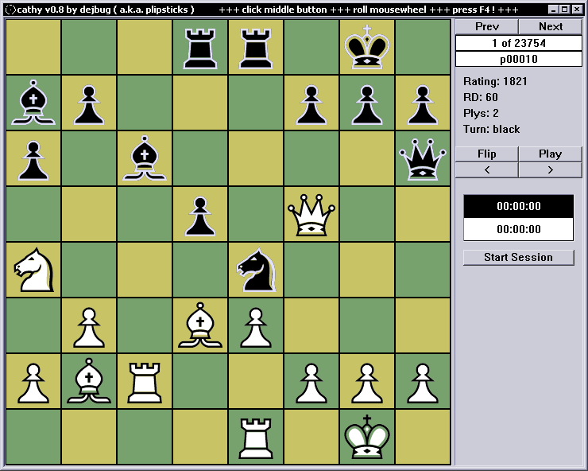

# cathy

Chess tactics trainer REVIVAL. A native version of the offline Chess Tactics Server.

This is **VERY OLD** code and will soon have to be massaged into shape.

# dependency

You will need to have a compatible chessfont installed. I've used the [Alpha Font](http://www.enpassant.dk/chess/fontimg/alpha.htm) by Eric Bentzen. Also note that you need to have the put the `base.cts` file in the same folder as your `cathy.exe`.

# usage

F4 *toggles the sidepane*.
Middle Mouse Button *(on the board) will load a random position*.
Mouse Wheel *steps through the moves*.

For now you play this by loading a new problem (MB-click) then scrolling down one tick (MWHEEL) and thinking. :P

The controls in the sidepanel are only rudimentary.

# related

The server seems to have been offline for some time [discussion1] (https://lichess.org/forum/general-chess-discussion/chess-tactics-server-httpchessemraldnet) but with occasional reappearances?  [discussion2](https://www.chess.com/forum/view/general/chess-tactics-server2).
